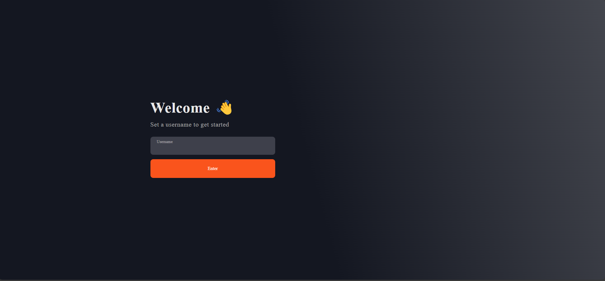
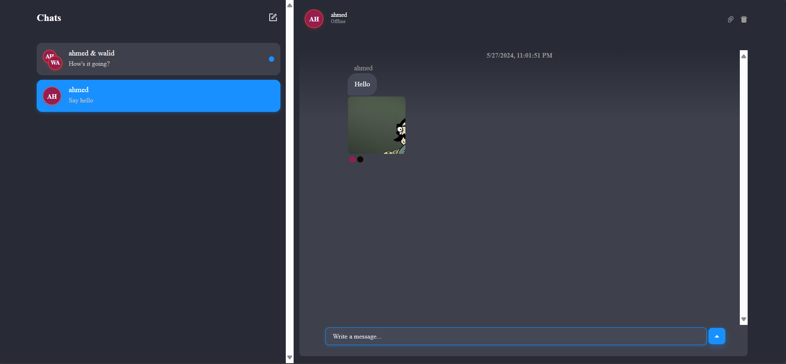
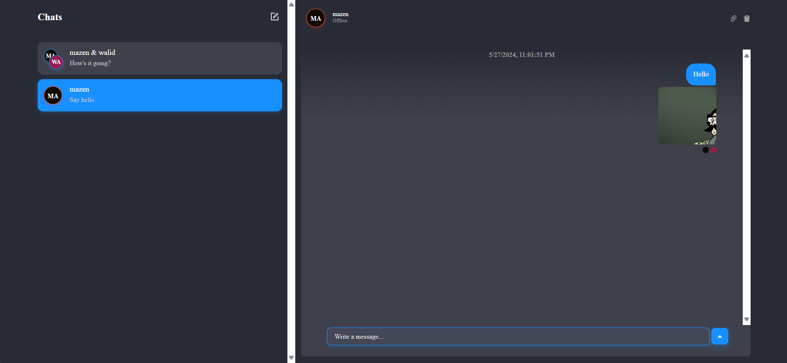
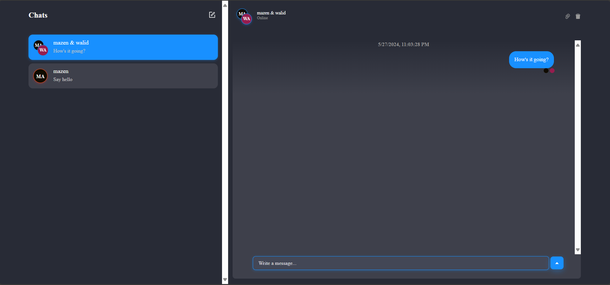
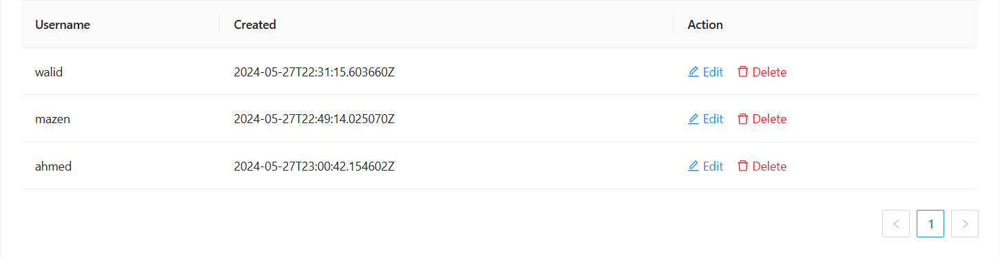

# Realtime Chat Website

This project is a real-time chat website built using React and Chat Engine.

## Features

- Realtime chat functionality
- Multiple chat windows
- User authentication

## Technologies Used

- React
- Chat Engine
- JavaScript

## UI/UX

### Create User


### User 1 POV


### User 2 POV 


### Group Chat POV


### Users Info On Chat Engine


## Installation

1. Clone the repository:

   ```bash
   git clone https://github.com/mazen251/Realtime-Chat-Website.git
   ```

2. Navigate to the project directory:

   ```bash
   cd Realtime-Chat-Website-master
   ```

3. Install the dependencies for both the client and server:

   ```bash
   cd client
   npm install

   cd ../server
   npm install
   ```

## Usage

1. Start the server:

   ```bash
   cd server
   npm start
   ```

2. Start the client:

   ```bash
   cd client
   npm run dev
   ```

3. Open your browser and go to `http://localhost:(provided port number)`.

## Code Overview

### `ChatsPage.js`

This file contains the main chat component which uses `PrettyChatWindow` from `react-chat-engine-pretty`.

```javascript
import { PrettyChatWindow } from 'react-chat-engine-pretty'

const ChatsPage = (props) => {
  return (
    <div style={{ height: '100vh' }}>
      <PrettyChatWindow
        projectId='a3108c6a-f173-4f4e-a0a0-c6791b62b2c7'
        username={props.user.username}
        secret={props.user.secret}
        style={{ height: '100%' }}
      />
    </div>
  )
}

export default ChatsPage
```

### `ChatsPage2.js`

This file contains the main chat components which uses `MultiChatSocket`, `MultiChatWindow` and `useMultiChatLogic` from `react-chat-engine-advanced`.

```javascript
import { MultiChatSocket, MultiChatWindow, useMultiChatLogic } from 'react-chat-engine-advanced'

const ChatsPage = (props) => {
  const chatProps = useMultiChatLogic(
    'a3108c6a-f173-4f4e-a0a0-c6791b62b2c7',
    props.user.username,
    props.user.secret
  );
  return (
    <div style={{ height: '100vh' }}>
      <MultiChatSocket {...chatProps} />
      <MultiChatWindow {...chatProps} style={{ height: '100%' }} />
    </div>
  );
}

export default ChatsPage2;
```

## Project Structure

- `client/`: Contains the React front-end code.
- `server/`: Contains the server-side code.


## Contributing

Contributions are welcomed. If you have suggestions for improvement or want to contribute to the project, please feel free to:

1. Fork the project
2. Create your feature branch (`git checkout -b feature/AmazingFeature`)
3. Commit your changes (`git commit -m 'Add some AmazingFeature'`)
4. Push to the branch (`git push origin feature/AmazingFeature`)
5. Open a Pull Request

## Contact
Mazen Walid - [@LinkdIn](https://www.linkedin.com/in/mazen-walid-225582208/)
